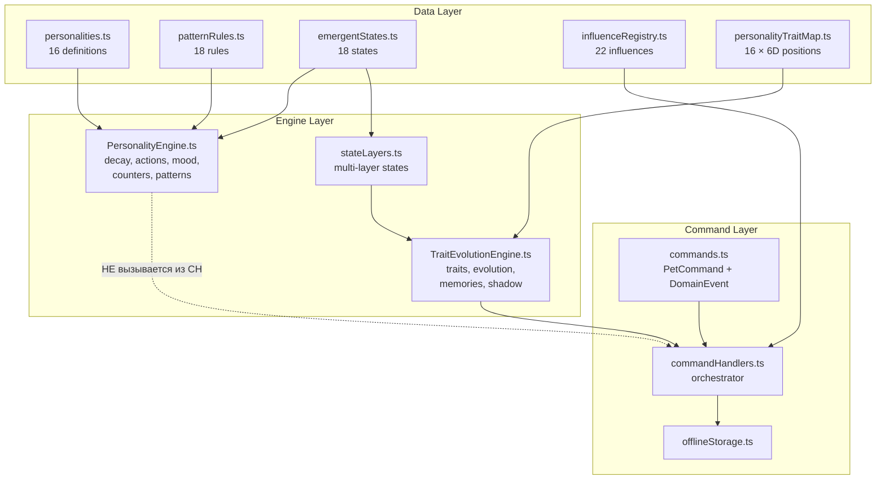

# 🔬 Аудит движка характеров — Personality Engine v5.0

> **Дата:** 2026-05-08 (свежее чтение всех файлов)  
> **Область:** `src/personality/` — 15 файлов, ~4600 строк  
> **Версия:** `5.0.0-offline-core.1` / `static-registry.5.0.0`

---

## 1. Текущие возможности

| Подсистема | Файл | LOC | Статус |
|---|---|---|---|
| Типы и контракты | `types.ts` | 551 | ✅ |
| 16 характеров (data registry) | `personalities.ts` | 741 | ✅ |
| Decay с модификаторами | `PersonalityEngine.ts` L84–127 | — | ✅ |
| Action modifiers (XP/coins/restore) | `PersonalityEngine.ts` L139–267 | — | ✅ |
| Pattern Engine (18 data-driven правил) | `patternRules.ts` | 284 | ✅ |
| 13 behavioral flags + heal | `PersonalityEngine.ts` L407–474 | — | ✅ |
| 18 emergent states | `emergentStates.ts` | 420 | ✅ |
| State Layers (multi-layer) | `stateLayers.ts` | 141 | ✅ |
| Trait Evolution (6D vector) | `TraitEvolutionEngine.ts` | 814 | ✅ |
| Influence Registry (22 static + remote) | `influenceRegistry.ts` | 271 | ✅ |
| Core Memories | `TraitEvolutionEngine.ts` L688–705 | — | ✅ |
| Formation → Evolution → Singularity | `TraitEvolutionEngine.ts` | — | ✅ |
| Shadow Form + Catharsis | `TraitEvolutionEngine.ts` L418–473 | — | ✅ |
| Legacy (cross-generation) | `TraitEvolutionEngine.ts` L475–547 | — | ✅ |
| Confused State (cognitive layer) | `TraitEvolutionEngine.ts` L560–605 | — | ✅ |
| Command/Event architecture | `commands.ts` + `commandHandlers.ts` | 475 | ✅ |
| Offline storage (localStorage) | `offlineStorage.ts` | 73 | ✅ |
| Memory text gen (Template + TinyAI) | `memoryTextGenerator.ts` | 121 | ✅ |
| Rolling Windows (7d/30d) | `PersonalityEngine.ts` L848–1010 | — | ✅ |
| Mood с bias | `PersonalityEngine.ts` L730–752 | — | ✅ |
| Trait Map (16 позиций в 6D) | `personalityTraitMap.ts` | 124 | ✅ |

---

## 2. Архитектурная карта



> [!IMPORTANT]
> `PersonalityEngine` и `TraitEvolutionEngine` — **два параллельных движка**. PE управляет gameplay (stats, decay, flags, emergent states), TEE управляет эволюцией (traits, memories, shadow). Связь между ними идёт через **три точки**: `commandHandlers.ts` (вызывает TEE), `mockApi` (вызывает PE), `stateLayers.ts` (синхронизирует emergent states обоих). **Проблема не в отсутствии связи, а в том, что она размазана** — нет единого оркестратора.

---

## 3. Критические проблемы

### 🔴 CRIT-1: commandHandlers не вызывает PersonalityEngine

[commandHandlers.ts](file:///Users/maxim/Projects/Java/arc-trends/Zdesagochi/src/personality/commandHandlers.ts) — оркестратор всей Command/Event архитектуры. Но он **НЕ** вызывает:

- `updateCounters()` — обновление behavioral counters
- `runPatternEngine()` — активация/heal флагов
- `computeEmergentState()` — вычисление gameplay-состояний
- `applyDecay()` — распад статов
- `computeNaturalPassives()` — пассивные бонусы
- `calcMoodWithBias()` — настроение

Все эти функции вызываются **снаружи** (из `mockApi.ts`). При переходе на реальный бэкенд вся gameplay-логика потеряется.

### 🔴 CRIT-2: Hardcoded personality IDs в «data-driven» движке

Комментарий в [personalities.ts L6](file:///Users/maxim/Projects/Java/arc-trends/Zdesagochi/src/personality/personalities.ts#L6): *«Движок PersonalityEngine не знает о конкретных id — читает объекты.»*

**Реальность** — в `PersonalityEngine.ts` найдены прямые проверки `personality.id ===` для **14 из 16** характеров:

| Характер | Строки в PersonalityEngine.ts |
|---|---|
| `chaotic` | L95, L154 |
| `empath` | L104, L712 |
| `anxious` | L107, L245, L383, L741–743 |
| `feral` | L110–115, L346–348 |
| `foodie` | L331, L697 |
| `stoic` | L240, L306 |
| `sage` | L319 |
| `pristine` | L378, L704 |
| `greedy` | L352 |
| `paranoid` | L362 |
| `bold` | L373 |
| `playful` | L373 |
| `melancholic` | L336 |
| `adventurer` | L341, L178 |

Добавление 17-го характера **невозможно** без правки движка.

### 🟡 ARCH-1: Два параллельных потока emergent states (частично решено)

> [!NOTE]
> `stateLayers.ts` уже реализует priority-derived разрешение конфликтов и explicit `exclusive` семантику (L14, L26). `syncLegacyEmergentState` (L107) выводит primary state по priority детерминированно. Проблема сместилась с «кто победит» на **orchestration order** — когда именно вызывается `computeEmergentState` vs `setLayeredEmergentState`.

| Источник | Формат | Кто вызывает |
| `setLayeredEmergentState()` | → multi-layer `pet.stateLayers` | `TraitEvolutionEngine` |
| `syncLegacyEmergentState()` | → перезаписывает `pet.emergentState` | `stateLayers.ts` автоматически |

**Оставшаяся проблема**: gameplay-состояния (`computeEmergentState`) не используют `setLayeredEmergentState`, а напрямую пишут в `pet.emergentState`. При интеграции в `commandHandlers` нужно будет маршрутизировать gameplay-состояния через layers.

---

## 4. Баги и противоречия

### 🐛 BUG-1: `enlightenmentActive` никогда не ставится в `true`

[PersonalityEngine.ts L319](file:///Users/maxim/Projects/Java/arc-trends/Zdesagochi/src/personality/PersonalityEngine.ts#L319):
```typescript
if (personality.id === 'sage' && !counters.enlightenmentActive) {
  if (counters.consecutiveGoodSyncs >= 7 * 24) {
    candidates.push({ type: 'enlightenment', priority: 11 });
  }
}
```

Guard `!counters.enlightenmentActive` проверяется, но **нигде** в коде `counters.enlightenmentActive` не устанавливается в `true` при входе в enlightenment. Sage может входить в enlightenment **бесконечно** после каждого выхода.

### 🐛 BUG-2: `stoicPeakUsed` никогда не ставится в `true`

[PersonalityEngine.ts L306](file:///Users/maxim/Projects/Java/arc-trends/Zdesagochi/src/personality/PersonalityEngine.ts#L306):
```typescript
if (personality.id === 'stoic' && !counters.stoicPeakUsed) {
```

Аналогично — `counters.stoicPeakUsed` проверяется, но **нигде** не устанавливается. Стоик может входить в `stoic_peak` повторно, вопреки комментарию *«Одноразовый взрыв»*.

### 🐛 BUG-3: `allStatsAbove` параметр игнорируется

[patternRules.ts L134](file:///Users/maxim/Projects/Java/arc-trends/Zdesagochi/src/personality/patternRules.ts#L134):
```typescript
{ type: 'consecutive_syncs_cond', params: { allStatsAbove: 70, threshold: 10 } }
```

Но в [PersonalityEngine.ts L510–512](file:///Users/maxim/Projects/Java/arc-trends/Zdesagochi/src/personality/PersonalityEngine.ts#L510-L512):
```typescript
case 'consecutive_syncs_cond': {
  const { threshold } = cond.params;
  return compare(c.consecutiveGoodSyncs, threshold, op);
}
```

`allStatsAbove` **не читается** — правило `perfect_balance` проверяет только `consecutiveGoodSyncs` (avg > 70), а не «каждый стат > 70».

### 🐛 BUG-4: Дубликаты priority в emergent states

В [emergentStates.ts](file:///Users/maxim/Projects/Java/arc-trends/Zdesagochi/src/personality/emergentStates.ts):
- `breakdown` → `priority: 1` (L39)
- `shadow_form` → `priority: 1` (L373)
- `contamination_crisis` → `priority: 2` (L64)
- `identity_crisis` → `priority: 2` (L352)

При сортировке `candidates.sort((a, b) => a.priority - b.priority)` результат для одинаковых приоритетов **недетерминирован** — порядок зависит от реализации `.sort()`.

### 🐛 BUG-5: Мёртвый код `anxiousMult`

[PersonalityEngine.ts L107](file:///Users/maxim/Projects/Java/arc-trends/Zdesagochi/src/personality/PersonalityEngine.ts#L107):
```typescript
const anxiousMult = (personality.id === 'anxious') ? 1.0 : 1.0;
```

Всегда `1.0` — noop. Включается в `multiplyAll`, но ничего не делает.

### 🐛 BUG-6: XP noop для меланхолика

[PersonalityEngine.ts L253–254](file:///Users/maxim/Projects/Java/arc-trends/Zdesagochi/src/personality/PersonalityEngine.ts#L253-L254):
```typescript
if (personality.specialRules?.xpEveryOtherAction) {
  result.xp = result.xp; // mockApi пропускает каждое второе
}
```

Присваивание самому себе — noop. Логика `xpEveryOtherAction` обрабатывается **вне движка**, но код оставляет ложное впечатление, что это обработано.

### ⚡ CONTRA-1: `perfect_balance` — пустой restore effect

[PersonalityEngine.ts L1077–1079](file:///Users/maxim/Projects/Java/arc-trends/Zdesagochi/src/personality/PersonalityEngine.ts#L1077-L1079):
```typescript
perfect_balance: {
  // пассивный бонус — обрабатывается в computeNaturalPassives
},
```

Но в `computeNaturalPassives` (L689–723) **нет** обработки `perfect_balance`. XP множитель задан только в `getFlagXpMult` (L1088: `mult *= 1.15`), а пассивного stat-бонуса нет.

### ⚡ CONTRA-2: `feast_frenzy` проверяет `playCountToday` вместо кормлений

[PersonalityEngine.ts L331](file:///Users/maxim/Projects/Java/arc-trends/Zdesagochi/src/personality/PersonalityEngine.ts#L331):
```typescript
if (personality.id === 'foodie' && counters.playCountToday >= 3 && stats.happiness > 90) {
```

Описание `feast_frenzy`: *«3 кормёжки за час»*. Но проверяется **`playCountToday`** (игры), а не `dailyFoodLog`. Неверный счётчик.

### 📦 DEBT-A: Три формата emergent state (осознанный legacy)

> [!NOTE]
> `pet.emergentState` **осознанно** оставлен как legacy-поле для UI/API совместимости. Источник правды постепенно переносится в `stateLayers`. Это tech debt, не баг.

```typescript
// computeEmergentState → single (legacy gameplay)
EmergentStateType | null

// applyActionModifiers → accepts array (forward-compatible)
emergentState: EmergentStateType | EmergentStateType[] | null

// stateLayers → layers map (новый source of truth)
pet.stateLayers: Partial<Record<EmergentStateLayer, ActiveEmergentState[]>>

// pet.emergentState → legacy single (для UI/API)
pet.emergentState: EmergentStateType | null
```

`syncLegacyEmergentState` берёт **только первый** (highest priority) из всех layers. Для UI этого достаточно, но при необходимости показывать **несколько** состояний одновременно — потребуется обновить API.

---

## 5. Барьеры для эволюции и обучения

### 🚧 B-1: Нет истории действий

`BehavioralCounters` — агрегированный снимок, не лог. Raw events теряются. `commandLog` в `OfflinePetSave` хранит команды только для offline-синхронизации. **Невозможно**: обучить модель на паттернах, воспроизвести «почему характер стал таким», сделать ретроспективный анализ.

### 🚧 B-2: Closed-world evolution — только 16 зон

`PERSONALITY_TRAIT_MAP` → жёстко 16 точек в 6D. `PersonalityId` — union type. Характер эволюционирует только **в существующую зону**. Нет гибридов, нет emergent personalities.

### 🚧 B-3: Core Memories — недостаточно features для causal learning

Memories уже имеют структурированные поля:
```typescript
interface CoreMemory {
  text: string;               // человеческий текст
  traitKey: TraitKey;         // связанная черта
  direction: 'up' | 'down' | 'origin';
  category: InfluenceCategory; // источник влияния
  personalityHint?: PersonalityId; // связь с зоной
  tier: 'rare' | 'common';   // важность
}
```

**Это не "просто текст"** — есть 5 машиночитаемых полей. Но этого **недостаточно для causal learning**: нельзя связать причину→следствие, нет embedding/hash для группировки, нет `features: Record<string, number>` для ML-пайплайнов.

### 🚧 B-4: Статичные параметры характера

Все `decayRates`, `restoreBonus`, `moodBias` — **константы** в `personalities.ts`. Характер не адаптируется к поведению пользователя.

### 🔍 B-5: Daily Budget и скорость эволюции (balance design)

> [!NOTE]
> Это **balance design**, а не однозначная проблема. Требуется подтверждение simulation-тестами.

Математически: `SMOOTHING_ALPHA = 0.08`, max budget `vitality: 12` → max дневной сдвиг = `12 × 0.08 = 0.96`. Для перехода Δ~40 нужно **~42 дня** + 72 sync стабильности. Вопрос: ощущается ли это слишком медленно для «живого» характера? Нужен A/B тест или simulation с разными alpha/budget.

### 🚧 B-6: Emergent states не влияют на trait vector

`shadow_form`, `tantrum`, `enlightenment` **не сдвигают** trait vector. Травматический опыт не меняет характер на уровне черт. Единственный канал — `traumaDelta` в influence registry, но emergent states его не используют.

### 🚧 B-7: `EVOLUTION_LEGACY` — применяется к traitVector, но не к economy

[personalityTraitMap.ts L92–123](file:///Users/maxim/Projects/Java/arc-trends/Zdesagochi/src/personality/personalityTraitMap.ts#L92-L123) — 6 бонусов определены. `recordLegacy` сохраняет `legacyVector` и `legacyCoefficient` в account. `createInitialTraitVector` (TEE L95–105) **уже использует** legacy для смещения стартового вектора.

**Что не применяется:** `xpMultiplierBonus`, `coinMultiplierBonus`, `uniqueTrait` — gameplay/economy бонусы из `EvolutionBonus` **нигде** не подключены к `applyActionModifiers` или `applyDecay`.

---

## 6. Технический долг

| ID | Проблема | Файл | Строка |
|---|---|---|---|
| TD-1 | `JSON.parse(JSON.stringify)` для deep clone Pet | `commandHandlers.ts` | L356 |
| TD-2 | Dual state: `pet.emergentState` + `pet.stateLayers` одновременно | `stateLayers.ts` | — |
| TD-3 | Global `let remoteRegistry` + no DI | `influenceRegistry.ts` | L12 |
| TD-4 | Нет runtime-валидации Pet shape в commandHandlers | `commandHandlers.ts` | L84 |
| TD-5 | `validatePatternRules` определена, но не вызывается при загрузке (в отличие от `validateInfluenceRegistry` в L270) | `patternRules.ts` | L210 |
| TD-6 | `newRoomBonusEnabled` в specialRules, но нет обработки в engine | `personalities.ts` | L668 |
| TD-7 | `TraitEvolutionContext` имеет `random` и `rng` — дублирующие поля | `TraitEvolutionEngine.ts` | L72–73 |

---

## 7. Рекомендации

### P0 — Исправить баги (срочно)

| # | Действие |
|---|---|
| BUG-1 | Установить `counters.enlightenmentActive = true` при входе в enlightenment |
| BUG-2 | Установить `counters.stoicPeakUsed = true` при входе в stoic_peak |
| BUG-3 | Добавить проверку `allStatsAbove` в `evalCondition` для `consecutive_syncs_cond` |
| BUG-4 | Развести `breakdown`/`shadow_form` и `contamination_crisis`/`identity_crisis` по разным priority |
| CONTRA-2 | Заменить `playCountToday` на счётчик кормлений в `feast_frenzy` |

### P1 — Интегрировать два движка

| # | Действие |
|---|---|
| CRIT-1 | Перенести `updateCounters`, `runPatternEngine`, `computeEmergentState`, `applyDecay` в `applyPersonalityCommand` |
| CRIT-3 | Единый источник emergent states — `stateLayers`, deprecated `pet.emergentState` |

### P2 — Data-driven refactor

| # | Действие |
|---|---|
| CRIT-2 | Перенести emergent-state условия в `PersonalityDefinition.emergentConditions` |
| BUG-5/6 | Удалить мёртвый код (`anxiousMult`, xp noop) |

### P3 — Открыть путь к обучению

| # | Действие |
|---|---|
| B-1 | Хранить `DomainEvent[]` в Pet |
| B-3 | Добавить `features: Record<string, number>` в CoreMemory для causal learning |
| B-4 | Ввести `personalityModifiers` в Pet, мержащий с базой |
| B-5 | Провести simulation-тесты для balance design (alpha/budget) |
| B-6 | Добавить `traitDeltas` в EmergentStateDefinition |
| B-7 | Подключить `xpMultiplierBonus`/`coinMultiplierBonus` из `EVOLUTION_LEGACY` к gameplay |

### P4 — Чистка

| # | Действие |
|---|---|
| TD-1 | `structuredClone()` вместо JSON clone |
| TD-2 | Полная миграция на `stateLayers` |
| TD-7 | Убрать дубликат `random`/`rng` в TraitEvolutionContext |

---

## Итоговая оценка

| Критерий | Оценка |
|---|---|
| Полнота механик | 85% |
| Data-driven чистота | 55% |
| Внутренняя согласованность | 60% |
| Готовность к эволюции | 45% |
| Готовность к обучению | 30% |
| Тестируемость | 80% |
| Offline-ready | 80% |

**Вердикт:** Движок зрелый в плане геймплея. `stateLayers` уже решает конфликты emergent states по priority. Остаются **5 активных багов** (enlightenment/stoicPeak guards, allStatsAbove, feast_frenzy counter, duplicate priorities), **размазанная оркестрация** между PE/TEE/mockApi, и **архитектурные ограничения** для causal learning. Главная точка боли — `commandHandlers` не интегрирует gameplay-логику, оставляя её в `mockApi`.

---

## Авторские правки

> Замечания автора проекта, учтённые в этом аудите:
> - CRIT-3 понижен до ARCH-1: `stateLayers` уже реализует priority-derived разрешение и exclusive семантику
> - CONTRA-3 переклассифицирован в DEBT-A: `pet.emergentState` осознанно оставлен как legacy для UI/API
> - B-5 (Daily Budget) переформулирован как balance design, требующий simulation-тестов
> - B-3 (Core Memories) уточнён: 5 машиночитаемых полей уже есть, проблема в causal learning
> - B-7 (EVOLUTION_LEGACY) уточнён: legacy применяется к стартовому traitVector, не хватает economy бонусов
> - Архитектурная заметка уточнена: PE и TEE связаны через 3 точки, проблема — размазанность связи
