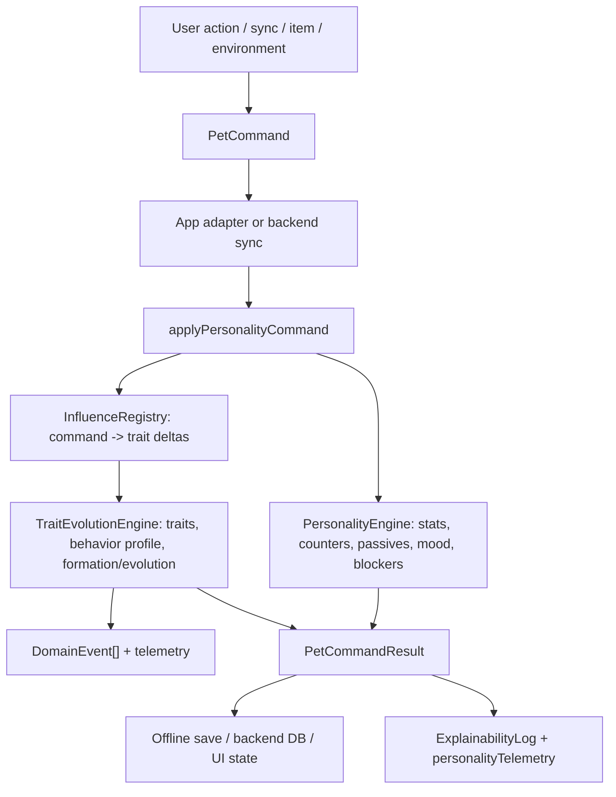

# Personality Engine LLM Knowledge Base

Last verified against code structure on 2026-05-22.

This document is the primary onboarding and operating manual for LLM coding agents working on the Zdesagochi personality engine. It is written to answer three questions quickly:

1. Where is the engine?
2. How does it work end to end?
3. How should an agent safely extend or change it without breaking parity, replay, or product behavior?

Do not treat older `.md` files as source of truth when they conflict with code. Use this document as a navigation map, then verify behavior in the referenced source files and tests before editing.

## Executive Summary

The personality engine is an offline-first, deterministic pet character system implemented primarily in TypeScript, with a Rust backend port for server-side command replay and sync.

The engine can:

- mutate pet stats and gameplay outcomes from commands;
- mutate long-term trait vectors from user behavior;
- form an initial personality after enough meaningful influence;
- evolve an already formed personality when both trait drift and behavior evidence support it;
- record behavior profile evidence separately from raw traits;
- handle state layers such as confused, shadow form, singularity, catharsis, void/identity crisis, and emergent gameplay states;
- emit explainability events and telemetry so changes are inspectable;
- replay offline command logs deterministically;
- keep Rust backend trait/radius/evidence/personality data generated from TS sources.

The engine cannot automatically invent new mechanics from personality data. If a new personality requires a new `specialRules` field, the rule must be added to types, validators, TS engine logic, Rust engine logic if server replay needs it, and tests.

## Source Map

### TypeScript Core Package

Path: `packages/personality-core/src`

This is the reusable engine package. It should not depend on app storage, UI, React, server API code, or mock API code.

Important files:

- `index.ts`: public package exports.
- `types.ts`: shared engine data types: stats, actions, traits, behavior axes, personality definitions, special rules.
- `coreState.ts`: `PersonalityState`, account/memory/runtime state, layered state shape.
- `commands.ts`: command/event/result contracts and offline command log helpers.
- `commandHandlers.ts`: main command application/replay pipeline.
- `TraitEvolutionEngine.ts`: trait vector, formation, evolution, behavior evidence, singularity, shadow form, catharsis, memories.
- `PersonalityEngine.ts`: stat decay, action modifiers, pattern engine, counters, emergent states, passives, mood.
- `engineFactory.ts`: package-level engine facade and preset validation.
- `personalityCatalog.ts`: canonical TS catalog for personality ids, trait homes, radius bases, behavior-evidence formulas.
- `personalityTraitMap.ts`: compatibility map derived from `personalityCatalog.ts`.
- `actionRules.ts`, `passiveRules.ts`, `decayRules.ts`, `patternRules.ts`: data-driven rules and validators.
- `stateLayers.ts`, `emergentStates.ts`, `gameplayStateRules.ts`: state layer semantics and derived gameplay states.
- `stateMigration.ts`: migration for persisted personality state snapshots.
- `engineVersion.ts`: engine/schema/registry version constants.

### Zdesagochi Preset Package

Path: `packages/personality-pet-preset/src`

This package provides the concrete Zdesagochi content plugged into the generic core package.

Important files:

- `personalities.ts`: canonical TS personality definitions for gameplay data: names, lore, restore bonuses, xp/coin multipliers, food preferences, auto sleep, mood bias, flags, triggers, special rules, visual profiles.
- `influenceRegistry.ts`: canonical TS influence registry. Influences convert commands/items/environment/social/system events into trait deltas and trauma deltas.
- `memoryTextGenerator.ts`: deterministic/template memory text generation.
- `zdesagochiPetPreset.ts`: assembles personalities, influence registry, intensity multiplier, memory generator, and validators into `PersonalityPreset`.
- `index.ts`: package exports.

### App Adapter Layer

Path: `src/api`

This layer adapts app `Pet` objects, mock API, offline save, sync queue, real API calls, and explainability logs to the engine. It is not the core engine.

Important files:

- `personalityPetAdapter.ts`: converts between app `Pet` and core `PersonalityState`.
- `petService.ts`: app-facing service that invokes mock/real API and sync behavior.
- `mockApi.ts`: local/offline gameplay implementation around the engine.
- `realApi.ts`: HTTP API adapter.
- `syncQueue.ts`, `localSave.ts`, `offlineStorage.ts`: offline-first persistence utilities.
- `explainability.ts`: records command explanations, personality telemetry samples, summaries, and details.
- `types.ts`: app API and backend contract types.

### Rust Backend Engine

Path: `backend/src/engine`

Rust exists to replay and validate personality commands server-side. It should stay behaviorally compatible with TS where server replay depends on the same outcome.

Important files:

- `mod.rs`: backend engine module declarations.
- `types.rs`: Rust mirror of core engine types.
- `command_handlers.rs`: Rust command application entry point and `EngineState` conversion to/from DB/domain pet.
- `trait_evolution.rs`: Rust trait/evolution logic.
- `personality_engine.rs`: Rust gameplay stat/passive/counter/emergent logic.
- `influence_registry.rs`: Rust influence registry mirror.
- `personality_catalog.rs`: generated Rust trait homes/radius/evidence from TS `personalityCatalog.ts`.
- `personality_definitions.rs`: generated Rust `PersonalityDefinition` data from TS `personalities.ts`.
- `personalities.rs`: small runtime accessor/cache around generated personality definitions.

Generated files are committed because Rust compiles from them. Do not edit them manually.

### Backend Sync/Telemetry

Important files outside `backend/src/engine`:

- `backend/src/handlers/sync.rs`: offline command sync, server replay, command result JSON, personality telemetry output and persistence hook.
- `backend/src/db/personality_telemetry_repo.rs`: DB persistence for personality telemetry samples.
- `backend/migrations/006_personality_telemetry.sql`: telemetry table.
- `backend/src/router.rs`: API route registration, including personality telemetry endpoint.

### Tests And Simulations

Important tests:

- `tests/personalityEvolution.test.ts`: broad TS engine tests, explainability, formation/evolution, state transitions, offline service behavior.
- `tests/personalityBehaviorSemantics.test.ts`: semantic behavior scenarios proving that user styles form/evolve into meaningful zones and do not collapse into one personality.
- `tests/personalityEngineInvariants.test.ts`: invariants such as skin uniqueness and label-invariant pre-formation behavior.
- `tests/e2eSimulation.test.ts`: high-level lifecycle simulation.
- `backend/src/engine/*` unit tests: Rust parity, behavior scenarios, evolution readiness, generated catalog sanity.
- `backend/tests/http_integration.rs`: backend HTTP flow.
- `tests/monteCarloSimulation.ts` and `scripts/run-monte-carlo.mjs`: product-level stochastic acceptance.

## High-Level Architecture



The engine is layered:

1. Data contracts: types, commands, state, personality definitions, influence registry.
2. Command handling: one command enters, one updated state and event list exits.
3. Gameplay logic: stats, action modifiers, blockers, mood, counters, emergent states.
4. Long-term personality logic: trait vector, behavior profile, formation, evolution, special identity states.
5. Adapters: app `Pet`, offline save, mock/real API, backend sync.
6. Observability: domain events, explainability records, personality telemetry, tests/simulations.

## Core State Model

The engine tracks several independent but related concepts.

### Immediate Pet State

Stats:

- `hunger`
- `happiness`
- `energy`
- `health`
- `cleanliness`
- `bond`

These stats affect mood, action outcomes, blockers, decay, counters, and context-sensitive trait influence.

### Long-Term Trait Vector

Traits:

- `vitality`
- `sociality`
- `order`
- `appetite`
- `caution`
- `curiosity`

The trait vector is the geometric position of the pet in personality space. Personality homes live in `PERSONALITY_TRAIT_HOMES`.

### Behavior Profile

Behavior axes:

- `care`
- `play`
- `social`
- `order`
- `exploration`
- `disruption`
- `recovery`

Behavior profile is separate from traits. It captures repeated user style. It exists to prevent evolution from being triggered by trait vector movement alone. For example, moving near a target zone is not enough after the behavior profile has enough samples; the long-term behavior evidence must also support that target.

### Formation And Evolution Fields

Important fields on `PersonalityState`:

- `personality`: current personality id.
- `formationComplete`: whether initial personality has formed.
- `formationProgress`: progress toward initial formation.
- `traitVector`: current trait vector.
- `behaviorProfile`: long-term behavior evidence.
- `currentTargetZone`: current potential evolution target.
- `ticksInTargetZone`: strict stability counter.
- `evolutionReadiness`: accumulated readiness.
- `evolutionReadinessTarget`: target for accumulated readiness.
- `evolutionProposal`: pending evolution proposal.
- `evolutionHistory`: accepted evolution records.
- `visitedZones`: zones visited for singularity/identity states.

### Memory And Identity State

The engine also tracks:

- `coreMemories`: rare/common memories tied to important trait/personality moments.
- `stateLayers`: layered states such as cognitive/evolution/special states.
- `traumaLevel`, `traumaCooldownUntil`, `catharsisProgress`, `xpBurstUntil`.
- `voidSyncs`, `singularityZones`, `dailyVectorVariance`, `confusedState`.

These are not cosmetic only; several of them gate actions, affect XP, or intercept evolution.

## Command Pipeline

The primary TS entry point is `applyPersonalityCommand` in `packages/personality-core/src/commandHandlers.ts`.

The equivalent Rust entry point is `apply_personality_command` in `backend/src/engine/command_handlers.rs`.

Typical flow:

1. Normalize command and context.
2. Load current personality definition.
3. Apply action blockers/special blockers if relevant.
4. Apply direct gameplay action effects.
5. Apply personality action modifiers.
6. Apply influence registry entry to trait vector, trauma, formation progress, and behavior profile.
7. Update behavioral counters.
8. Apply decay/sync effects for sync commands.
9. Check formation/evolution/state transitions.
10. Emit domain events.
11. Return updated pet state, applied modifiers, gameplay outcome, and events.

Commands are defined in `commands.ts` and currently include:

- `feed`
- `play`
- `sleep`
- `wake`
- `bathe`
- `heal`
- `bond`
- `sync`
- `use_item`

The offline command log helpers in `commands.ts` support deterministic replay:

- `createOfflinePetSave`
- `appendOfflineCommand`
- `getUnsyncedCommands`
- `markCommandsSynced`

## Formation Mechanics

Initial formation happens before `formationComplete`.

Formation progress is affected by applied trait deltas and influence category weights:

- action: `1.0`
- item: `1.5`
- training: `2.0`
- discipline: `1.5`
- cosmetic: `1.2`
- environment: `0.8`
- social: `2.0`
- system: `0.0`

Important constants:

- `FORMATION_THRESHOLD = 200`
- `PRE_FORMATION_SENSITIVITY_MULTIPLIER = 5.0`
- `SMOOTHING_ALPHA = 0.08`

When progress reaches threshold, the engine picks the personality with the highest depth of immersion for the current trait vector. Formation is meant to be sensitive enough to user behavior, but deterministic enough to replay.

Pre-formation sync must be label-invariant. Tests explicitly check that placeholder personality labels do not bias formation.

## Evolution Mechanics

Evolution applies only after formation.

The engine does not immediately switch personality when the vector moves. It requires:

1. Current personality depth to be outside current home enough to matter.
2. A best target candidate from personality trait space.
3. Behavior evidence for that target once behavior profile has enough samples.
4. Stability/readiness through either strict target-zone ticks or accumulated readiness.
5. Hysteresis so small drift near boundaries does not churn.

Important constants:

- `STABILITY_SYNCS = 72`
- `HYSTERESIS = 8`
- `POST_FORMATION_ADAPTATION_MULTIPLIER = 4.0`
- `BEHAVIOR_PROFILE_EVOLUTION_MIN_SAMPLES = 24`
- `BEHAVIOR_PROFILE_EVOLUTION_THRESHOLD = 28`
- `EVOLUTION_READINESS_THRESHOLD = 100`
- `EVOLUTION_READINESS_GAIN_PER_CONFIRMED_SYNC = 35`
- `EVOLUTION_READINESS_DECAY_PER_SYNC = 2`
- `NEAR_TARGET_READINESS_MARGIN = 0.25`
- `NEAR_TARGET_READINESS_GAIN_MULTIPLIER = 0.60`
- `BEHAVIOR_TARGET_DEPTH_BONUS = 0.45`

Behavior evidence is configured in `PERSONALITY_BEHAVIOR_EVIDENCE`. Example: `curious` is supported by exploration/order/social and penalized by disruption.

The engine emits an evolution proposal; it does not silently accept it. Acceptance is explicit through `acceptEvolution`, which records history and memory.

## Regression And Stability

When a pet is formed, sync can regress the trait vector slightly toward its current personality home:

- `REGRESSION_RATE = 0.02`

This protects against infinite drift but must not erase meaningful sustained behavior. Behavior profile and readiness were added specifically to avoid noisy collapse and to make post-formation change possible.

## Behavior Profile

Behavior profile is updated from influence ids, not directly from final personality labels.

Examples:

- `action:feed` -> care/social
- `action:play` -> play/exploration
- `action:bond` -> social/care
- `action:bathe` -> order/care
- `action:heal` -> recovery/care
- natural sleep -> order/care
- forced sleep / early wake -> disruption and reduced order
- exploration items/environment -> exploration/play/social depending on item

Decay:

- `BEHAVIOR_PROFILE_DECAY_PER_DAY = 0.96`

This means behavior evidence is long-lived but can adapt over time.

## Special Identity States

The engine has several long-term identity mechanisms.

### Confused

Triggered by high daily vector variance:

- `CONFUSED_VARIANCE_THRESHOLD = 25`

Natural sleep can clear it only after enough sleep. Hard reset requires longer full sleep.

### Shadow Form And Catharsis

Shadow form is trauma-based:

- `SHADOW_FORM_TRAUMA_THRESHOLD = 75`
- `SHADOW_FORM_COOLDOWN_DAYS = 14`

Catharsis can exit shadow form and grant a temporary XP burst:

- `CATHARSIS_THRESHOLD = 100`
- `CATHARSIS_XP_BURST_MULTIPLIER = 5`

### Singularity

Singularity detects near-equal immersion into multiple zones:

- `SINGULARITY_EPSILON = 0.15`
- `SINGULARITY_THRESHOLD_SYNCS = 48`

Singularity can intercept normal evolution and collapse into one active zone.

### Void / Identity Crisis

If the pet spends too long without a valid target zone:

- `VOID_THRESHOLD_SYNCS = 7 * 24`

It can enter identity crisis state.

## Gameplay Systems

`PersonalityEngine.ts` and Rust `personality_engine.rs` handle:

- stat decay;
- mood with personality bias;
- natural passives;
- action modifiers;
- action blockers;
- pattern rules;
- behavioral counters;
- emergent states.

Important concepts:

- `applyDecay`: applies base stat decay modified by personality decay rates and rule multipliers.
- `applyActionModifiers`: modifies XP, coins, restore values, food preferences, special rules.
- `isActionBlocked`: checks state/personality blockers.
- `computeEmergentState`: derives current emergent gameplay state.
- `runPatternEngine`: derives flags from rolling behavior/counters.
- `updateCounters`: updates rolling windows and personality-specific counters.
- `computeNaturalPassives`: applies passive stat bonuses.
- `calcMoodWithBias`: computes mood from stats plus personality bias.

## Data-Driven Content

### Personality Ids, Trait Homes, Radius, Behavior Evidence

Canonical file:

- `packages/personality-core/src/personalityCatalog.ts`

Generated Rust file:

- `backend/src/engine/personality_catalog.rs`

Generator:

- `scripts/generate-rust-personality-catalog.mjs`

Check:

- `npm run check:rust-personality-catalog`

### Full Personality Definitions

Canonical TS file:

- `packages/personality-pet-preset/src/personalities.ts`

Generated Rust file:

- `backend/src/engine/personality_definitions.rs`

Generator:

- `scripts/generate-rust-personality-definitions.mjs`

Check:

- `npm run check:rust-personality-definitions`

### Influences

Canonical TS preset:

- `packages/personality-pet-preset/src/influenceRegistry.ts`

Rust mirror:

- `backend/src/engine/influence_registry.rs`

This is still a parity-sensitive area. Treat influence changes as engine changes and test both TS and Rust.

### Rules

Rule data:

- `actionRules.ts`
- `passiveRules.ts`
- `decayRules.ts`
- `patternRules.ts`

Each has validation tests. Prefer adding rule objects over hard-coded branching when the existing rule engine can express the behavior.

## Generated Files Policy

Generated files are committed, but not edited manually.

Generated:

- `backend/src/engine/personality_catalog.rs`
- `backend/src/engine/personality_definitions.rs`

Regenerate after changing TS source:

```bash
npm run generate:rust-personality-catalog
npm run generate:rust-personality-definitions
cargo fmt
```

Then run checks:

```bash
npm run check:rust-personality-catalog
npm run check:rust-personality-definitions
```

`npm test` already includes these checks.

## How To Add A New Personality

For a normal personality without a new engine mechanic:

1. Add id, trait home, radius, and behavior evidence to `packages/personality-core/src/personalityCatalog.ts`.
2. Add full personality definition to `packages/personality-pet-preset/src/personalities.ts`.
3. Regenerate Rust files:

```bash
npm run generate:rust-personality-catalog
npm run generate:rust-personality-definitions
cargo fmt
```

4. Add TS tests proving:

- the personality is visible through catalog/preset;
- depth is `1` at its own trait home;
- evolution can target it when trait vector and behavior evidence support it.

5. Run:

```bash
npm test
npm run build
cargo test
cargo clippy -- -D warnings
git diff --check
```

If the personality uses only existing data fields, no manual Rust personality data edit should be needed.

For a personality with a new unique mechanic:

1. Add field to `PersonalitySpecialRules` in TS `types.ts`.
2. Add field to Rust `PersonalitySpecialRules` in `backend/src/engine/types.rs`.
3. Add validator metadata in `packages/personality-pet-preset/src/personalities.ts`.
4. Implement TS behavior in the relevant engine module.
5. Implement Rust behavior if backend replay needs parity.
6. Add tests that fail without the new behavior.
7. Regenerate Rust definitions if the preset uses the new field.

Do not add unexplained `specialRules` fields to personality data. The validator should reject unknown fields.

## How To Add A New Influence

1. Add TS influence in `packages/personality-pet-preset/src/influenceRegistry.ts`.
2. If server replay needs it, mirror it in `backend/src/engine/influence_registry.rs`.
3. Decide behavior-profile signal if the influence should affect long-term behavior evidence.
4. Add tests proving:

- trait deltas apply;
- cooldown/conditions work;
- behavior profile changes if intended;
- TS/Rust parity remains intact if backend uses it.

Influence categories affect formation weight. Be intentional.

## How To Change Evolution Behavior

Change evolution only with tests and simulations. High-risk areas:

- sensitivity multipliers;
- behavior evidence threshold;
- readiness gain/decay;
- regression rate;
- target-zone selection;
- dynamic radius;
- hysteresis;
- behavior profile decay;
- singularity/void/shadow intercepts.

Required proof for evolution changes:

- focused unit test in `tests/personalityEvolution.test.ts`;
- semantic scenario in `tests/personalityBehaviorSemantics.test.ts` if behavior meaning changes;
- Rust parity test if backend behavior changes;
- Monte Carlo report if thresholds or population behavior change.

Run:

```bash
npm test
npm run simulate:montecarlo
cargo test
cargo clippy -- -D warnings
```

## How To Change Gameplay Modifiers

For stat, XP, coin, decay, passives, blockers, mood, or emergent state behavior:

1. Prefer rule data if expressible.
2. If hard-coded logic is required, isolate it in `PersonalityEngine.ts` and Rust `personality_engine.rs`.
3. Add tests around the exact modifier/counter/blocker.
4. Check economy caps:

- XP max/min;
- coin max/min;
- stat restore additive max;
- decay multiplier max/min.

Avoid hidden buffs that are not visible in applied modifiers or tests.

## Observability And Explainability

The engine emits domain events. Important personality-related events include:

- `trait_changed`
- `behavior_profile_changed`
- `evolution_readiness_changed`
- `formation_completed`
- `evolution_proposed`
- `evolution_recorded`
- state/memory/sleep/catharsis events depending on command path.

Client explainability lives in:

- `src/api/explainability.ts`

It records:

- command summary;
- event-derived details;
- `personalityTelemetry`;
- player-facing personality summary/details.

Backend personality telemetry:

- produced in `backend/src/handlers/sync.rs`;
- stored through `backend/src/db/personality_telemetry_repo.rs`;
- schema in `backend/migrations/006_personality_telemetry.sql`;
- API type in `src/api/types.ts`;
- real API method in `src/api/realApi.ts`.

Use telemetry when debugging “why did the character change?” Do not rely only on final personality id.

## Offline-First And Replay Guarantees

The engine is designed for offline command capture and deterministic replay.

Key contracts:

- commands must have stable `commandId`;
- command replay must be idempotent by command id at the queue level;
- command result should not depend on wall-clock randomness unless deterministic rng/context is provided;
- server replay must accept/reject command batches consistently;
- migration must handle old persisted snapshots safely.

Tests cover:

- offline save/load;
- command log compaction;
- sync queue dedupe;
- backend replay stale batch rejection;
- package quickstart replay.

When changing command behavior, ask:

- Does this affect old offline saves?
- Does this affect backend replay?
- Does this need a schema migration?
- Does this emit enough events for explainability?

## TS/Rust Parity Model

TypeScript is the source of truth for reusable engine and content data. Rust mirrors or generates what backend replay requires.

Current generated parity:

- trait homes/radius/evidence: TS `personalityCatalog.ts` -> Rust `personality_catalog.rs`;
- full personality definitions: TS `personalities.ts` -> Rust `personality_definitions.rs`.

Current manual parity-sensitive areas:

- influence registry;
- command handling;
- gameplay engine;
- trait evolution algorithms;
- type definitions;
- backend command result JSON contract.

If changing parity-sensitive behavior, update both TS and Rust or explicitly document why backend does not need the behavior.

## What The Engine Reacts To

The engine reacts to:

- direct user actions: feeding, playing, sleeping, waking, bathing, healing, bonding;
- item usage;
- sync time passage;
- pet stats at action time;
- local hour/time of day;
- repeated action patterns;
- food variety/repetition;
- session gaps;
- room stay duration;
- forced sleep and early wake;
- trauma/care/recovery loops;
- personality special rules;
- influence cooldowns and conditions;
- account lineage/legacy state;
- behavior profile history.

The engine does not react to:

- arbitrary UI clicks unless converted to commands/influences;
- visual skin alone except where mapped through existing personality/skin utilities;
- unregistered personality ids;
- unknown `specialRules`;
- unregistered influence ids;
- backend-only data not converted into `EngineState`;
- telemetry alone. Telemetry observes; it does not mutate personality.

## Current Capabilities

The engine is capable of:

- stable initial formation from user behavior;
- post-formation adaptation;
- preventing noisy evolution from unsupported behavior spikes;
- explaining character movement through events and telemetry;
- preserving replay/offline behavior;
- supporting new normal personalities with generated backend data;
- handling rare state arcs like shadow form, catharsis, singularity, and void;
- running semantic simulations to detect collapse into one personality.

## Current Limitations And Known Risk Areas

1. Influence registry parity is still manual between TS and Rust.
2. Algorithm parity is manual between TS and Rust.
3. New `specialRules` still require code in both runtimes if used by backend.
4. Generated Rust uses TS source parsing scripts, not a formal AST parser. The scripts are intentionally narrow; keep source objects simple and literal.
5. Some generated checks compare normalized Rust text. If generator/rustfmt behavior changes, checks may need adjustment.
6. Monte Carlo acceptance should be rerun after threshold changes; unit tests alone are not enough.
7. Production build currently warns about a large Vite chunk; this is not personality-specific but remains a frontend build warning.

## LLM Agent Operating Rules

Follow these rules when modifying the personality engine.

1. Read code before editing. Use this document to find files, not as a substitute for source.
2. Do not edit generated Rust files manually.
3. Do not add personality ids in one runtime only.
4. Do not add unknown `specialRules` without validator support and tests.
5. Do not change thresholds without tests that would fail before the change.
6. Do not trust passing tests if you only asserted current broken behavior. Write tests against intended logic.
7. If behavior changes in TS and backend replay depends on it, update Rust too.
8. If command result JSON changes, update API types and tests.
9. Preserve offline replay determinism.
10. Keep changes scoped. Avoid broad refactors while tuning gameplay balance.

## Recommended Change Workflow

For most engine changes:

```bash
rg "relevantSymbol" packages/personality-core/src backend/src/engine tests
npm test
cargo test
```

Then edit.

After editing:

```bash
npm run generate:rust-personality-catalog
npm run generate:rust-personality-definitions
cargo fmt
npm test
npm run build
cargo test
cargo clippy -- -D warnings
git diff --check
```

If thresholds or broad behavior changed:

```bash
npm run simulate:montecarlo
```

If only docs changed, tests may be unnecessary, but for engine code changes run the full set.

## Good Tests For This Engine

A good personality-engine test proves logic, not implementation trivia.

Good:

- “food-heavy behavior forms/evolves toward food/care personality, not pristine/drowsy”
- “unsupported behavior profile prevents evolution even when trait vector is near target”
- “same formation history forms same personality regardless of placeholder label”
- “forced sleep increases disruption and does not masquerade as calm care”
- “new personality can be selected by evolution when both vector and behavior evidence match”

Weak:

- “function returns some object”
- “event count is non-zero”
- “snapshot equals current broken output”
- “test only checks that code path runs”

When fixing a bug, first add a failing test that describes the desired behavior. Then change implementation. Then verify with broader tests.

## Key Proof Commands

Minimum proof for normal engine/data work:

```bash
npm test
npm run build
cargo test
cargo clippy -- -D warnings
git diff --check
```

Additional proof for balance/evolution threshold work:

```bash
npm run simulate:montecarlo
```

Generated file proof:

```bash
npm run check:rust-personality-catalog
npm run check:rust-personality-definitions
```

## Practical Examples

### Add A Normal Personality

Files to edit:

- `packages/personality-core/src/personalityCatalog.ts`
- `packages/personality-pet-preset/src/personalities.ts`
- tests in `tests/personalityEvolution.test.ts` or semantic tests.

Then generate:

```bash
npm run generate:rust-personality-catalog
npm run generate:rust-personality-definitions
cargo fmt
```

Do not edit:

- `backend/src/engine/personality_catalog.rs`
- `backend/src/engine/personality_definitions.rs`

### Add A New Behavior Axis

This is high risk.

Likely files:

- TS `types.ts` for `BEHAVIOR_AXES`;
- TS `TraitEvolutionEngine.ts` initial profile and behavior updates;
- TS `personalityCatalog.ts` evidence configs;
- Rust `types.rs` `BehaviorAxis`;
- Rust behavior profile/default/serialization code;
- generated catalog script if axis naming changes;
- UI labels in `EvolutionInspector.tsx`;
- explainability telemetry if surfaced;
- tests and simulations.

### Add A New Special Rule

Likely files:

- TS `types.ts`;
- TS validator metadata in `personalities.ts`;
- TS logic in `PersonalityEngine.ts` or `commandHandlers.ts`;
- Rust `types.rs`;
- Rust generated definitions script if new field must generate;
- Rust logic in `personality_engine.rs` or `command_handlers.rs`;
- tests proving behavior and unknown-rule rejection.

## File Ownership Boundaries

Core package must not import:

- app API;
- storage;
- mock API;
- React/UI;
- backend code.

Preset package may import core types and validators, but not app API.

App API may import core and preset.

Backend Rust does not import TS at runtime. It uses generated Rust source committed in the repo.

`scripts/check-personality-package-boundaries.mjs` enforces part of this boundary.

## Glossary

- Personality id: symbolic id such as `playful`, `drowsy`, `curious`.
- Personality definition: gameplay/content object with name, modifiers, food preferences, triggers, special rules.
- Trait vector: six-dimensional long-term character position.
- Trait home: target vector for a personality.
- Radius base: base radius for depth-of-immersion calculation.
- Depth of immersion: normalized closeness to a personality home.
- Behavior profile: long-term action-style evidence across behavior axes.
- Evolution readiness: accumulated confidence toward a target personality.
- Evolution proposal: pending suggestion to switch personality.
- Influence: data object converting command/context into trait deltas/trauma.
- Emergent state: derived state such as tantrum, apathy, enlightenment, chaos surge.
- State layer: system for multiple simultaneous identity/cognitive/evolution states.
- Generated Rust catalog: committed Rust code derived from TS data.

## Current Best Mental Model

Think of the engine as two coupled systems:

1. Gameplay personality: affects stats, XP, coins, mood, blockers, passives, flags.
2. Identity evolution: observes behavior and trait drift to form/evolve character.

The first system makes the current personality matter immediately. The second system decides whether the current personality should remain true over time.

A correct change should usually preserve both:

- the pet reacts in the moment;
- the character changes only when long-term evidence supports it.

